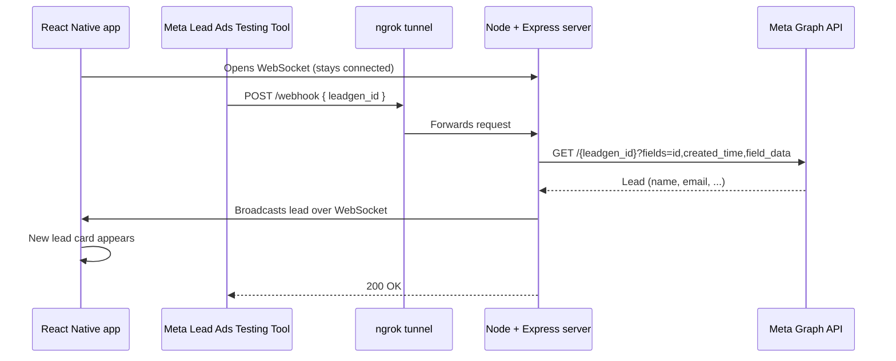

# Meta Leads Live

A proof of concept where a lead submitted through **Meta Lead Ads** shows up **instantly** in an already-open **React Native** screen, with no refresh and no interaction on the device.

| Demo | Link |
| --- | --- |
| 1: live demo | `https://drive.google.com/file/d/1H1AGOhOXSMjquAqhq5f1ozz2Q-tNj7nz/view?usp=sharing` |
| 2: code and architecture walkthrough | `https://drive.google.com/file/d/1kOkL_0hxMlw9uOPrIWHg6YszyRVsLggH/view?usp=sharing` |

---

## How it works



1. When a lead is submitted, Meta sends a small webhook to `POST /webhook`. It contains only a `leadgen_id`, **not** the lead data itself.
2. The server uses the Page access token to fetch the full lead from the Graph API.
3. The server broadcasts the lead as JSON to every connected WebSocket client.
4. The app is already connected, so it prepends a new card to the list.

The WebSocket server shares the same HTTP server and port as Express (`3000`).

## Tech stack

| Layer | Tech |
| --- | --- |
| Mobile app | React Native, Expo, Expo Router, TypeScript |
| Backend | Node.js (18+), Express, `ws`, `dotenv` |
| Lead source | Meta Lead Ads, Lead Ads Testing Tool, Graph API v26.0 |
| Tunnel | ngrok (static domain), so Meta can reach `localhost` |

## Project structure

```
leads-app/
├── server/
│   ├── src/server.js        # Express webhook + WebSocket broadcast
│   ├── .env.example         # Required environment variables
│   └── package.json
└── src/
    ├── app/
    │   ├── _layout.tsx      # Fonts, dark theme, root stack
    │   └── index.tsx        # Leads screen (FlatList)
    ├── components/
    │   ├── status-pill.tsx  # Live / Connecting / Offline badge
    │   ├── lead-card.tsx    # Lead card with entrance animation
    │   └── empty-state.tsx  # "Waiting for leads" state
    ├── hooks/use-leads.ts   # WebSocket connection, reconnect, dedupe
    ├── constants/
    │   ├── brand.ts         # Design tokens (colors, spacing, fonts)
    │   └── server.ts        # Resolves the WebSocket URL
    └── types/lead.ts        # Lead type
```

## Getting started

### Prerequisites

- Node.js 18 or newer (the server uses the built-in `fetch`)
- The Expo Go app on a phone, or an iOS/Android simulator
- A free [ngrok](https://ngrok.com) account with a static domain
- A Meta developer app connected to a Facebook Page with an Instant Form (see [Meta setup](#meta-setup))

### 1. Start the server

```bash
cd server
npm install
cp .env.example .env     # then fill in the two values
npm start
```

Expected output:

```
Server running at http://localhost:3000
```

### 2. Expose it with ngrok

```bash
ngrok http --url=YOUR-DOMAIN.ngrok-free.app 3000
```

### 3. Start the app

From the repo root:

```bash
npm install
npx expo start
```

Open it in Expo Go (phone and laptop on the **same Wi-Fi**) or in a simulator. The status pill should turn green and say **Live**.

### 4. Send a test lead

1. Open Meta's **Lead Ads Testing Tool**.
2. Pick your Page and form, optionally edit the field values, and click **Create lead**.
3. Watch the app. The new lead card appears within a second or two, with no interaction.

## Environment variables

`server/.env`

| Variable | Description |
| --- | --- |
| `VERIFY_TOKEN` | Any string you choose. Must match the verify token entered in Meta's webhook settings. |
| `PAGE_ACCESS_TOKEN` | Long-lived Page access token used to fetch lead details from the Graph API. |

Optional, in the app's environment:

| Variable | Description |
|---|---|
| `EXPO_PUBLIC_WS_URL` | Overrides the WebSocket URL, for example `wss://your-domain.ngrok-free.app`. |

By default the app derives the server address from the Expo dev server's host, so a phone on the same Wi-Fi connects to `ws://<laptop-ip>:3000` with no configuration.

## Meta setup

1. Create a Meta app and connect a Facebook **Page** that has an **Instant Form**.
2. Generate a **Page access token** that does not expire:
   - Create a user token with `leads_retrieval`, `pages_manage_ads`, `pages_read_engagement`, `pages_show_list` and `pages_manage_metadata`.
   - Exchange it for a long-lived user token.
   - Call `me/accounts` with it and copy the Page's `access_token`.
3. In **Webhooks**, choose the **Page** object and set:
   - Callback URL: `https://YOUR-DOMAIN.ngrok-free.app/webhook`
   - Verify token: the same value as `VERIFY_TOKEN`
   - Subscribe to the **`leadgen`** field.
4. Make sure the Page is subscribed to the app for `leadgen`.
5. Publish the app (Live mode) so the Testing Tool's webhooks are delivered.

## Key implementation details

- **WebSocket sharing the HTTP server.** `new WebSocket.Server({ server })` attaches the socket server to the same port as Express, so one tunnel and one process serve both.
- **Fetch-after-webhook.** Meta's webhook carries only an ID, so the server retrieves the actual lead from the Graph API.
- **Guard against bad responses.** The server only broadcasts when Graph returns a real lead with an `id`. Errors (such as an expired token) are logged and never reach the app.
- **Reconnect and dedupe.** `useLeads` reconnects automatically after 2 seconds if the socket drops, and ignores a lead whose `id` it already has, since Meta may deliver the same webhook more than once.
- **Animated feedback.** The status pill pulses while live, and each new card fades up with a short-lived "NEW" badge.

## Troubleshooting

| Symptom | Likely cause and fix |
| --- | --- |
| Pill shows **Offline** on a phone | Phone and laptop are on different networks, or the firewall blocks port 3000. Allow Node.js on private networks. |
| Server logs `code 190` | The Page token expired. Generate a long-lived Page token (see Meta setup). |
| Server logs `Unsupported get request` (code 100) | The token lacks a required permission, or the user lacks Lead Access for the Page. Check the token in Meta's Access Token Debugger. |
| No `POST /webhook` appears in the server log | The webhook is not reaching you. Open `http://127.0.0.1:4040` (ngrok inspector) to see incoming requests, and confirm the callback URL and `leadgen` subscription. |
| Card shows odd initials or "Unknown" | The Testing Tool fills dummy values. Edit the name and email before clicking **Create lead**. |

## Security notes

- `.env` files are git-ignored. Only `server/.env.example` is committed.
- The Page access token and verify token must never be committed or shared.

## Assumptions and limitations

See [ASSUMPTIONS.md](./ASSUMPTIONS.md).
